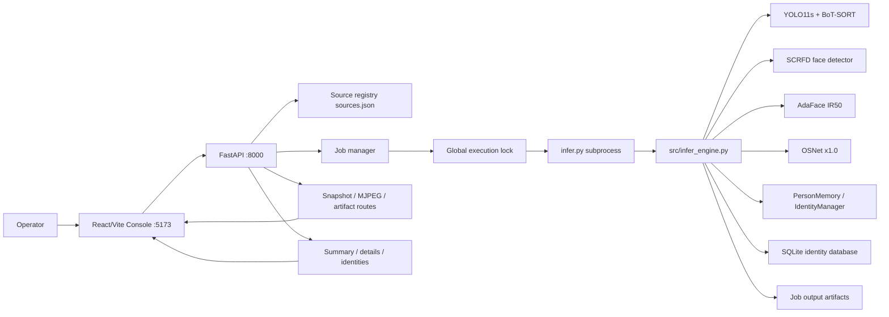
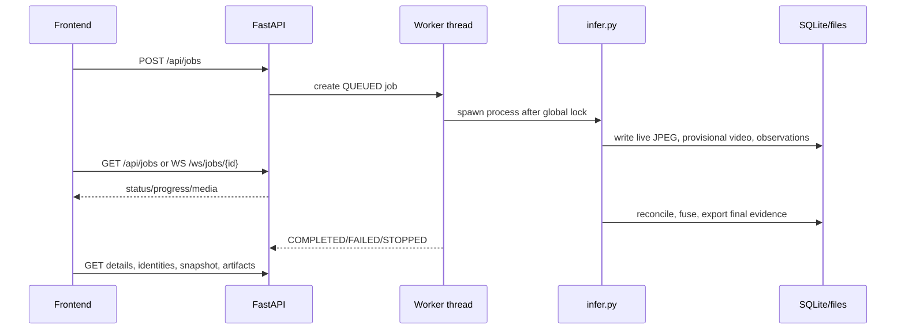
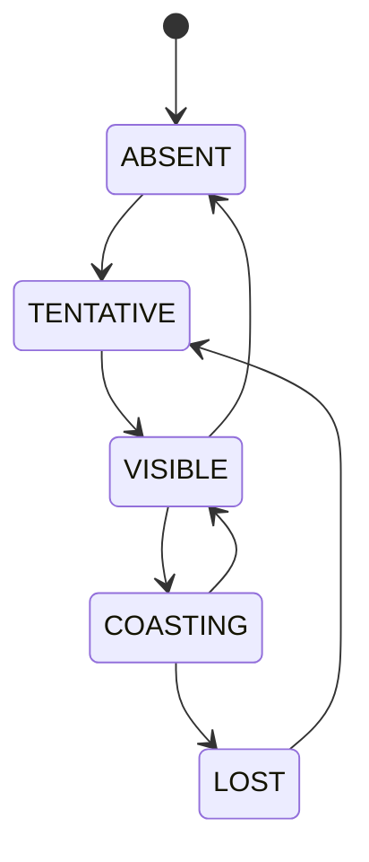

# Project Overview

## Identity

- Project name: `Person Identity Tracking — CLEAN`.
- Version marker: `2.1.0-face-anchor-authority` (`VERSION`).
- Repository root: `person_identity_tracking`.
- Runtime is a local Windows application. The project root expects the parent workspace `D:\Work\Tinasoft\DetectPerson` to contain `.venv` and `.cache`.

## Purpose

The system processes people in video, webcam, or RTSP/HTTP streams. It detects persons, tracks them, extracts face and body evidence, recognizes employees when a gallery is supplied, learns anonymous per-run identities (`P001`, `P002`, ...), persists observations and assignments in SQLite, and exports visual/data evidence.

The stated identity policy is:

- Face evidence is the authority for employee identity.
- Body ReID supports short-gap continuity and reacquisition only.
- Body ReID must not independently change an employee ID.
- People outside an employee gallery remain `UNKNOWN` when employee recognition is used.
- Without a gallery, anonymous person-memory profiles are created.

Primary source: `README.md:23-34`; implementation: `src/infer_engine.py`, `src/person_memory.py`, `src/identity_manager.py`.

## Users and capabilities

The source does not define user accounts or user roles. The practical user is an operator/developer who configures cameras, starts inference, monitors output, and reviews evidence through the local web console.

Implemented capabilities:

- Person detection using YOLO11s.
- Person tracking using Ultralytics BoT-SORT.
- Local body ReID/continuity using OSNet x1.0.
- Head ROI extraction.
- Face detection using SCRFD ONNX.
- Five-point face alignment.
- Face quality and geometric pose scoring.
- Face embeddings using AdaFace IR50.
- Optional employee gallery matching.
- Anonymous face-memory profiles.
- Temporal face tracking with visible/coasting/lost states.
- Ambiguity/crossing protection.
- SQLite observations, assignments, identity events, and fusion decisions.
- Canonical database export and read-only search.
- Face/body prototype storage.
- Representative face/body crop storage.
- CSV/JSON/NPZ/SQLite output export.
- Provisional live annotated JPEG and MP4 recording.
- Final reconciled MP4 rendering for seekable file sources.
- FastAPI source/job/media/evidence API.
- React/Vite local console.
- Upload source, backend webcam source, and RTSP/HTTP source registration.
- Job queue with a single global inference execution lock.
- Job stop and retry actions.
- Job log and artifact download.
- Job status WebSocket.

Not implemented or not found:

- Authentication and authorization.
- Employee CRUD API.
- Camera edit/enable/disable API.
- Human conflict approval/rejection API.
- Global identity registry across jobs.
- Browser-compatible video playback artifact.
- Redis, Celery, external message queue, scheduler, or service separation.
- Dockerfile and Docker Compose.

## Component responsibilities

| Component | Responsibility |
| --- | --- |
| Camera/video source | Provides frames from file, webcam, RTSP, or HTTP. |
| `src/infer_engine.py` | Loads models, processes frames, tracks people, creates face/body evidence, reconciles identities, and exports results. |
| `src/face_detector.py`, `src/scrfd_runtime.py` | SCRFD face detection and landmark decoding. |
| `src/adaface_quality.py` | AdaFace IR50 embedding and feature norm extraction. |
| `src/reid_embedder.py` | OSNet/TorchReID body embeddings. |
| `src/face_temporal_tracker.py` | Face detection temporal smoothing and coasting. |
| `src/person_memory.py` | Anonymous profile lifecycle, face authority, body continuity, segments, crops, and memory persistence. |
| `src/identity_manager.py` | Gallery employee identity confirmation and reassignment. |
| `src/gallery.py` | Employee gallery loading, face extraction, prototypes, and matching. |
| `src/identity_database.py` | SQLite source of truth for observations, tracklets, assignments, events, and fusion. |
| `src/evidence_fusion.py` | Combines canonical face/body evidence into final decisions. |
| `backend/app.py` | FastAPI API, source registry, job management, worker process launch, media serving, and evidence queries. |
| `frontend/src/App.tsx` | Shell, monitor, source form, memory, review, and legacy unused component definitions. |
| `frontend/src/ArchiveView.tsx` | Active history/processing ledger screen. |
| `frontend/src/RunDetailDrawer.tsx` | Active session evidence modal. |
| `frontend/src/api.ts` | Frontend HTTP client and TypeScript contracts. |

# Feature Summary

| Feature | Status | Evidence |
| --- | --- | --- |
| Person detection | IMPLEMENTED | `src/infer_engine.py:212-223`, YOLO `classes=[0]`. |
| Person tracking | IMPLEMENTED | Ultralytics `model.track(..., persist=True)`, `src/infer_engine.py:212-223`. |
| BoT-SORT ReID | IMPLEMENTED | `tracker_botsort_reid.yaml:4-18`. |
| Face detection | IMPLEMENTED | `src/scrfd_runtime.py`, `src/infer_engine.py:358-393`. |
| Face recognition against gallery | IMPLEMENTED | `src/gallery.py`, `src/identity_manager.py`. |
| Anonymous face identities | IMPLEMENTED | `src/person_memory.py`, IDs `Pxxx`. |
| Body ReID continuity | IMPLEMENTED | `src/reid_embedder.py`, `src/person_memory.py:1056-1105`. |
| Cross/ambiguity protection | IMPLEMENTED | `src/infer_engine.py:127-149`, `src/person_memory.py`. |
| Identity reconciliation | IMPLEMENTED | `src/infer_engine.py:988-1084`. |
| SQLite evidence store | IMPLEMENTED | `src/identity_database.py`. |
| Canonical identity database | IMPLEMENTED | `build_identity_db.py`, `IdentityDatabase.export_canonical`. |
| Video file input | IMPLEMENTED | CLI and web upload flow. |
| Webcam input | PARTIAL | Backend camera index works; browser device and backend index are separate. |
| RTSP/HTTP input | PARTIAL | Preview reconnect exists; final reconciled rendering is skipped. |
| Realtime live overlay | IMPLEMENTED | Live JPEG files and `/api/jobs/{id}/media/live.mjpeg`. |
| Browser video playback | PARTIAL | MP4 is `mp4v`; backend reports `playback_url: null`. |
| History | IMPLEMENTED | `ArchiveView`, `/api/jobs`. |
| Session details | IMPLEMENTED | `/api/jobs/{id}/details`. |
| Identity memory UI | IMPLEMENTED | `Memory` in `App.tsx`, `/identities`. |
| Human review workflow | PARTIAL | Read-only summary screen; no decision mutation API. |
| Authentication | NOT FOUND | No auth code or auth endpoint. |
| Docker | NOT FOUND | No Dockerfile or Compose file. |

# Repository Structure

```text
person_identity_tracking/
├── PROJECT_HANDOFF.md
├── README.md
├── VERSION
├── requirements.txt
├── tracker_botsort_reid.yaml
├── infer.py
├── analyze_run.py
├── build_identity_db.py
├── check.py
├── setup.ps1
├── enter_env.ps1
├── run_video.ps1
├── run_epfl.ps1
├── download_epfl.ps1
├── download_scrfd10g.ps1
├── start_console.ps1
├── gallery/
│   └── README.md
├── src/
│   ├── infer_engine.py
│   ├── models.py
│   ├── head_roi.py
│   ├── face_detector.py
│   ├── scrfd_runtime.py
│   ├── face_utils.py
│   ├── face_quality.py
│   ├── adaface_quality.py
│   ├── face_temporal_tracker.py
│   ├── reid_embedder.py
│   ├── prototypes.py
│   ├── gallery.py
│   ├── identity_manager.py
│   ├── anonymous_face_recognizer.py
│   ├── person_memory.py
│   ├── identity_database.py
│   ├── evidence_fusion.py
│   └── embedding_store.py
├── backend/
│   ├── app.py
│   ├── README.md
│   └── __init__.py
├── frontend/
│   ├── package.json
│   ├── package-lock.json
│   ├── vite.config.ts
│   ├── index.html
│   └── src/
│       ├── main.tsx
│       ├── App.tsx
│       ├── api.ts
│       ├── ArchiveView.tsx
│       ├── RunDetailDrawer.tsx
│       └── *.css
├── tests/
│   └── test_regressions.py
├── data/                 # local/generated sample video, ignored
├── models/               # downloaded model files, ignored
├── third_party/          # cloned AdaFace/deep-person-reid, ignored
├── runs/                 # CLI output, ignored
└── .appdata/             # console sources/jobs/uploads/logs, ignored
```

Generated/vendor directories do not need to be inspected as source: `.git`, `.venv`, `frontend/node_modules`, `__pycache__`, `models`, `third_party`, `data`, `runs`, and `.appdata`. They do affect runtime and are described below.

# System Architecture



There is no Redis, Celery, external AI microservice, scheduler, or database server. AI execution is a child Python process started by FastAPI. SQLite and filesystem output are per-job.

## Process architecture

1. FastAPI imports `backend.app` and creates a global `JobManager`.
2. `JobManager.submit()` creates a job directory and starts a daemon Python thread.
3. The thread waits for a global `threading.Lock` so only one inference subprocess runs.
4. The thread invokes `infer.py` using the selected Python executable.
5. `infer.py` delegates to `src.infer_engine.main()`.
6. The subprocess writes output into `.appdata/jobs/<job-id>/output`.
7. The worker thread waits for process exit and writes `status.json`.
8. Frontend polls `/api/jobs` every three seconds. It can also use the available job WebSocket, but the current frontend does not.

Sources: `backend/app.py:159-254`; `infer.py:1-4`; `frontend/src/App.tsx:64-82`.

# End-to-End Runtime Flow

## Startup

1. `backend.app` computes `ROOT`, `.appdata`, `jobs`, and `sources.json` paths (`backend/app.py:29-35`).
2. `JobManager.__init__` creates `.appdata` and `.appdata/jobs`, then loads every `*/status.json` (`backend/app.py:159-185`).
3. Persisted `RUNNING` jobs are converted to `FAILED` with a restart error. No process resume exists.
4. FastAPI starts with CORS restricted to localhost ports 5173 (`backend/app.py:319-322`).
5. React mounts `App`, fetches jobs and sources, and polls every three seconds (`frontend/src/App.tsx:56-82`).

## File/upload flow

```text
Browser file
→ POST /api/uploads multipart field file
→ .appdata/uploads/<12-char-id>.<extension>
→ POST /api/sources with stored path
→ POST /api/jobs with source_id
→ queued job directory and request/status JSON
→ worker infer.py subprocess
```

Frontend source: `frontend/src/App.tsx:588-619`. Backend upload: `backend/app.py:357-373`; job creation: `backend/app.py:435-469`.

## Webcam flow

```text
GET /api/cameras
→ OpenCV probes backend indexes 0..5 using DirectShow
→ frontend selects backend index
→ browser preview optionally calls getUserMedia with browser deviceId
→ POST /api/sources uri=<backend index>
→ POST /api/jobs device=<selected backend index>
→ infer.py/Ultralytics opens the backend camera
```

The browser preview device and backend capture device are not guaranteed to be the same physical camera. Browser labels cannot be mapped to backend indexes by current code. Sources: `backend/app.py:335-349`; `frontend/src/App.tsx:570-638`.

## AI frame flow

```text
source frames
→ YOLO person detection/tracking, class 0
→ person bbox and local track ID
→ ambiguity/crossing calculation
→ body crop/quality/OSNet sampling
→ head ROI
→ SCRFD face boxes + landmarks
→ face temporal tracker
→ alignment + blur/pose/size/quality
→ AdaFace 512-D face embedding
→ optional employee gallery match
→ anonymous face-memory match or new Pxxx profile
→ SQLite detections/observations/assignments
→ annotated frame
→ live JPEG and provisional local MP4
```

Primary orchestration: `src/infer_engine.py:180-607`.

## Finalization flow

After all source frames are consumed:

1. Track-level face/body prototypes are aggregated.
2. Offline face reconciliation can replace track segment identities.
3. Pre-bind observations may be backfilled where accepted.
4. Canonical DB face/body evidence is searched.
5. `TrackletEvidenceFusion` generates final decisions.
6. Final assignments and segment data are persisted.
7. Canonical references are promoted.
8. CSV, JSON, NPZ, SQLite, memory crops, and final render are written.

Source: `src/infer_engine.py:988-1184`.



# AI Models

## YOLO11s person detector

- Name: YOLO11s.
- Library: Ultralytics.
- Default path: `models/yolo/yolo11s.pt`.
- Loader: `YOLO(args.yolo)` in `src/infer_engine.py:197-223`.
- Device: `args.device`, default CLI `0`; CUDA uses half precision unless `--no-half`.
- Input: source frames handled by Ultralytics tracking.
- Image size: `--imgsz`, default 640.
- Confidence: `--conf`, default 0.10.
- Classes: `[0]`, COCO person only.
- Output used: `result.orig_img`, `result.boxes.xyxy`, `result.boxes.id`, `result.boxes.conf`.
- Coordinates: absolute pixels in original frame coordinates.
- NMS: delegated to Ultralytics; no project-specific NMS implementation.
- Dependency: supplies person boxes and local tracker IDs for every later face/body operation.

Sources: `src/infer_engine.py:197-223`, `src/infer_engine.py:787-802`.

## BoT-SORT tracker

- Library: Ultralytics built-in tracker.
- Config: `tracker_botsort_reid.yaml`.
- Values:
  - `tracker_type: botsort`
  - `track_high_thresh: 0.25`
  - `track_low_thresh: 0.10`
  - `new_track_thresh: 0.30`
  - `track_buffer: 60`
  - `match_thresh: 0.80`
  - `fuse_score: True`
  - `gmc_method: none`
  - `proximity_thresh: 0.50`
  - `appearance_thresh: 0.82`
  - `with_reid: True`
  - `model: auto`
- Project OSNet is not configured as native BoT-SORT model; OSNet is separately used by `PersonMemory`.
- Track ID is local to a camera/run and is not globally stable.

Source: `tracker_botsort_reid.yaml:4-18`; call site: `src/infer_engine.py:212-223`.

## SCRFD face detector

- Name: SCRFD 10G by default, 2.5G fallback.
- Runtime: ONNX Runtime/OpenCV wrapper.
- Model resolution: `models/scrfd/det_10g.onnx`, fallback `det_2.5g.onnx`.
- Loader: `SCRFDDetector` in `src/face_detector.py:18-32`; ONNX runtime in `src/scrfd_runtime.py:35-98`.
- Device: CPU provider or CUDA provider plus CPU fallback.
- Input: BGR square head ROI letterboxed to top-left.
- Input size: 640x640 for 10G; 320x320 default for 2.5G.
- Preprocessing: OpenCV blob, mean 127.5, scale 1/128, `swapRB=True`.
- Output: confidence, `[x1,y1,x2,y2]`, five landmarks.
- NMS IoU threshold: 0.4.
- Face boxes/landmarks are converted back to original frame coordinates.
- Models without landmarks are rejected.
- Detector threshold: `--face-det-threshold`, default 0.20.
- Detector runs every `--face-every` frames, default 2.
- Minimum face detect size: default 16 pixels.

Sources: `src/scrfd_runtime.py:71-202`; `src/infer_engine.py:614-637`, `811-823`.

## AdaFace IR50

- Name: AdaFace IR50.
- Library: PyTorch model loaded from cloned `third_party/AdaFace`.
- Checkpoint: `models/adaface/adaface_ir50_webface4m.ckpt`.
- Loader: `AdaFaceQualityEmbedder` in `src/adaface_quality.py:12-53`.
- Input: aligned 112x112 BGR face image.
- Normalization: `(pixel / 255 - 0.5) / 0.5`; NCHW tensor.
- Output: L2-normalized 512-dimensional face embedding and raw feature norm.
- Feature norm contributes to quality, not direct identity threshold.
- Alignment uses ArcFace five-point template in `src/face_utils.py:9-49`.
- Gallery and anonymous memory use cosine similarity via normalized dot product.
- The loader does not explicitly BGR→RGB convert; this is a current implementation limitation.
- Runtime patch: setup changes AdaFace `view` to `reshape` for current PyTorch compatibility.

Sources: `src/adaface_quality.py:55-77`; `src/face_utils.py`; `setup.ps1:103-129`.

## OSNet x1.0 body ReID

- Name: OSNet x1.0.
- Library: project-local `deep-person-reid`/TorchReID.
- Model: `models/osnet/osnet_x1_0_msmt17.pth`.
- Loader: `src/reid_embedder.py:9-46`.
- Input: BGR person crop converted to RGB; TorchReID transform.
- Output: L2-normalized embedding, expected dimension 512.
- Sampling: default every 4 frames.
- Minimum body quality: 0.35.
- Per-track reservoir: default maximum 128 embeddings.
- Usage: short-gap body continuity, body views, motion/reacquisition support.
- Not authoritative for employee identity and cannot permanently confirm an employee.

Sources: `src/reid_embedder.py:48-107`; `src/infer_engine.py:312-355`, `804-810`.

## No pose model in the identity pipeline

`models/pose/yolo11n-pose.pt` exists locally, but no source reviewed loads or uses it in `infer_engine.py`. Pose in the identity pipeline is a landmark geometry proxy, not a pose model. Status: NOT FOUND as an active pipeline capability.

# Detection, Tracking, and Recognition

## Person detection

Main function: `process_camera()` in `src/infer_engine.py`.

Input/output:

- Input: one source string and CLI configuration.
- Output: person frame bounding boxes, detector confidence, local tracker IDs.
- Box format: `[x1, y1, x2, y2]`, absolute pixels.
- Only class 0 is processed.

## Person tracking

Track key:

```python
(camera_name, local_track_id)
```

`camera_name` is derived from numeric source or source path stem (`src/infer_engine.py:53-58`). Local tracker IDs can be reused across sessions. SQLite adds a generated `session_id` to avoid cross-session collisions (`src/identity_database.py:43-59`).

## Ambiguity/crossing

Two person boxes are ambiguous if:

- IoU >= 0.50, or
- intersection-over-smaller-box >= 0.75.

Ambiguous frames pause body learning, set the detection ambiguous flag, and apply a grace period. This is box-overlap-based and does not solve every crossing.

Sources: `src/infer_engine.py:127-149`, `src/person_memory.py:518-535`.

## Head ROI and face selection

Head ROI is derived from person box (`src/head_roi.py:15-30`): horizontal expansion 30%, start 16% above person top, end at 52% of person height. Candidate faces must have center inside the person box. Candidate ranking uses SCRFD score × face-area^0.25 plus previous-face IoU/center continuity bonus.

## Face temporal state

`FaceTemporalTracker` stores smoothed box/landmarks, detector score, hit/miss counts, and last detector frame. States are `ABSENT`, `TENTATIVE`, `VISIBLE`, `COASTING`, `LOST`.

Default detector cadence is every 2 frames; minimum hits 2; maximum misses 7; EMA alpha 0.40. Coasting geometry is for display/continuity and does not create recognition evidence.

Source: `src/face_temporal_tracker.py:8-123`.

## Face quality and pose

Quality weights:

- Detector score: 26%.
- Face size: 23%.
- Blur/Laplacian: 14%.
- Pose proxy: 14%.
- Landmark plausibility: 13%.
- AdaFace feature norm: 10%.

Pose buckets use landmark geometry:

- `left`: yaw proxy < -0.25.
- `right`: yaw proxy > 0.25.
- `front`: otherwise.

Tiers:

- `reject`: face < 18 px or quality < 0.18.
- `weak`: face < 32 px or quality < 0.45.
- `support`: face < 48 px or quality < 0.68.
- `strong`: otherwise.

Sources: `src/face_quality.py:34-121`.

## Employee identity

Gallery path convention:

```text
gallery/
├── EMP001/
│   ├── front.jpg
│   └── left30.jpg
└── EMP002/
```

Gallery images are face-detected, aligned, quality-filtered, and aggregated into pose prototypes. Matching uses cosine similarity, default threshold 0.55, margin 0.07, and quality penalties. `IdentityManager` requires repeated accepted evidence; default three confirmations and cumulative quality weight 1.45. Strong faces may fast-path after two observations and weight 1.35.

Sources: `src/gallery.py:44-121`; `src/identity_manager.py:30-116`; `gallery/README.md`.

## Anonymous identity

Anonymous profiles are `P001`, `P002`, etc. They are learned by `PersonMemory`, not guaranteed employee identities. Existing profile matching requires score >= 0.56 and margin >= 0.04 by default. New identities require repeated face similarity >= 0.72 and default three confirmations.

Face authority can verify, bind, split, rebind, and reacquire profile segments. Unknown trusted faces on an anchored profile are held as conflicts and not learned.

Sources: `src/anonymous_face_recognizer.py:30-70`; `src/person_memory.py:751-1004`.

## ID meanings

| ID | Meaning | Stability |
| --- | --- | --- |
| `track_id` / local track ID | Integer assigned by BoT-SORT for a local camera/run track. | Not stable across sessions; may switch/reuse. |
| `tracklet_id` | SQLite row ID for a tracklet, scoped by database/session. | Stable within one job database. |
| `person_id` | Anonymous memory profile, represented in UI as `P001`, etc. | Stable within the memory/database lineage, not a global employee identity. |
| `employee_id` | Gallery identity such as `EMP001`. | Stable only if gallery/canonical identity data says so. |
| `identity_id` | Integer SQLite/canonical identity ID. | Stable within a canonical database lineage. |
| `session_id` | Random SQLite session UUID. | Unique per runtime database session. |
| `camera` | Derived camera/source name, e.g. `cam0` or file stem. | Can collide for duplicate stems. |

# Camera and Video Flow

## Accepted sources

| Kind | Value | Processing |
| --- | --- | --- |
| `upload` | Managed local file path returned by upload flow. | Seekable file inference; final identity render is possible. |
| `webcam` | Numeric backend index such as `0`. | Backend/OpenCV/Ultralytics capture. Final second-pass render is skipped. |
| `rtsp` | RTSP/HTTP URL. | Network stream; preview reconnect exists. Final second-pass render is skipped. |

## Camera discovery

`GET /api/cameras` probes indexes 0 through 5 using `cv2.VideoCapture(index, cv2.CAP_DSHOW)`, reads one frame, and returns available indexes and dimensions. It is Windows/DirectShow oriented and opens physical devices during probing.

## Camera start/stop

- Source registration persists a source in `.appdata/sources.json`.
- Job creation starts inference asynchronously.
- Running job stop calls `Popen.terminate()` on Windows and marks cancellation/stop states.
- There is no graceful signal protocol from backend to `infer.py`.
- There is no camera broker; source preview and inference can contend for the same physical camera.

## Frame/media outputs

- Live annotated frame: `output/live/<camera>.jpg`, written atomically through a temporary file.
- Provisional recording: `<camera>_local_identity.mp4.partial`, renamed after normal worker completion.
- Final file-source render: `<camera>_identity.mp4.partial`, renamed after normal final rendering.
- OpenCV writers use `mp4v`. This is not a dependable browser playback codec.
- Browser console currently uses JPEG snapshot/live media and treats MP4 as download-only.

## Coordinate system

All person and face coordinates are absolute pixel coordinates in the original frame. Face ROI coordinates are translated back from ROI space. Crops are clipped to frame bounds; minimum crop width is 12 and height 24 (`src/infer_engine.py:60-67`).

Frontend must use the actual image/video intrinsic dimensions when scaling boxes. The API does not currently expose a dedicated frame metadata object on each detection response.

# API Reference

## Common rules

- Base URL default: `http://127.0.0.1:8000/api`.
- No endpoint requires authentication.
- CORS allows `http://localhost:5173` and `http://127.0.0.1:5173`.
- Datetimes are Unix epoch seconds as floating point values.
- API uses JSON except upload multipart, image, video, artifact, and MJPEG responses.
- Job IDs allow ASCII letters, digits, `_`, and `-`.

## `GET /api/health`

Purpose: service health.

Response:

```json
{"ok": true, "service": "identity-tracking-console", "jobs": 1}
```

Source: `backend/app.py:325-327`.

## `GET /api/cameras`

Purpose: discover backend camera indexes 0..5.

Response:

```json
[
  {"index": 0, "label": "Laptop / USB camera 0", "width": 640, "height": 480}
]
```

Source: `backend/app.py:335-349`.

Errors: no custom error body for individual unavailable indexes; unavailable indexes are omitted.

## `GET /api/sources`

Purpose: list persisted input sources.

Response:

```json
[
  {
    "id": "44968a8d98",
    "name": "Laptop camera",
    "kind": "webcam",
    "uri": "0",
    "location": "Lobby",
    "enabled": true
  }
]
```

RTSP username/password is masked in this endpoint only.

Source: `backend/app.py:330-332`, `86-95`.

## `POST /api/sources`

Request:

```json
{
  "name": "Camera 1",
  "kind": "upload",
  "uri": "D:\\path\\video.mp4",
  "location": "Lobby",
  "enabled": true
}
```

Schema:

- `name`: required, 1..80 chars.
- `kind`: exactly `upload`, `webcam`, or `rtsp`.
- `uri`: optional string, max 2048, default empty.
- `location`: optional string, max 120, default empty.
- `enabled`: bool, default true.

Response: source object with generated 10-character hexadecimal ID.

Source: `backend/app.py:98-104`, `335-341`.

## `DELETE /api/sources/{source_id}`

Purpose: remove source. Running jobs matching source URI or label are stopped first.

Response:

```json
{"ok": true}
```

Nonexistent source also returns success. Source deletion has no undo.

Source: `backend/app.py:344-354`.

## `POST /api/uploads`

Request: multipart form field `file`.

Allowed extensions: `.mp4`, `.avi`, `.mov`, `.mkv`, `.webm`. Maximum 2 GiB.

Response:

```json
{
  "id": "12lowercasehex",
  "name": "original.mp4",
  "path": "D:\\...\\.appdata\\uploads\\12lowercasehex.mp4",
  "preview_url": "/api/uploads/12lowercasehex/mjpeg"
}
```

The absolute server path is currently exposed. The file is stored under `.appdata/uploads`.

Errors: `415` unsupported extension, `413` over 2 GiB.

Source: `backend/app.py:357-373`.

## `GET /api/uploads/{upload_id}`

Returns the original upload as a file. Current response media type is always `video/mp4`, even if extension is AVI/MOV/MKV/WebM.

Errors: `400` invalid upload ID, `404` missing upload.

Source: `backend/app.py:59-65`, `376-379`.

## `GET /api/uploads/{upload_id}/mjpeg`

Streams the original upload through OpenCV as `multipart/x-mixed-replace; boundary=frame`. This is raw source preview, not identity inference.

Source: `backend/app.py:382-405`.

## `GET /api/sources/{source_id}/mjpeg`

Streams webcam or RTSP/HTTP source frames as raw MJPEG. Upload sources return `400 Use the upload video endpoint for file sources`. RTSP/HTTP read failures cause a one-second reconnect loop.

Source: `backend/app.py:408-415`, `387-405`.

## `POST /api/jobs`

Request:

```json
{
  "source_id": "optional-source-id",
  "source": "optional-direct-source",
  "name": "Identity tracking job",
  "device": "0",
  "gallery": null,
  "canonical_db": null,
  "extra_args": []
}
```

The job can use either registered `source_id` or direct `source`. Registered disabled sources are rejected with `409`. Webcam sources must be numeric.

Protected `extra_args` are rejected if they override `--sources`, `--output`, `--identity-db`, `--canonical-db`, or `--gallery`.

Response: full public `Job` object described below.

Source: `backend/app.py:106-114`, `418-469`.

## `GET /api/jobs`

Returns all in-memory/persisted jobs sorted newest first. Response is an array of public `Job` objects.

Source: `backend/app.py:549-551`.

## `GET /api/jobs/{job_id}`

Returns one public `Job` object. `404` if absent.

Source: `backend/app.py:554-556`.

## `POST /api/jobs/{job_id}/stop`

Stops queued/running job and returns public job. Running jobs transition through `CANCEL_REQUESTED` and are terminated; queued jobs become `STOPPED` immediately.

Source: `backend/app.py:559-561`, `264-286`.

## `POST /api/jobs/{job_id}/retry`

Creates a new job named `Retry · <old name>`. It currently resets device to `0`, gallery to null, canonical DB to null, and extra args to empty. It is not a faithful retry.

Source: `backend/app.py:564-573`.

## `GET /api/jobs/{job_id}/media`

Response:

```json
{
  "state": "LIVE|READY|PARTIAL|UNAVAILABLE",
  "consistency": "LIVE_PROVISIONAL|FINAL_RECONCILED|PARTIAL_UNRECONCILED",
  "live_url": "/api/jobs/id/media/live.mjpeg",
  "snapshot_url": "/api/jobs/id/media/snapshot.jpg",
  "playback_url": null,
  "download_url": "/api/jobs/id/artifacts/cam_identity.mp4",
  "warning": "MP4 is download-only until a browser-compatible encoder is configured."
}
```

The current backend always sets `playback_url` to null. It selects video files by `_identity.mp4` suffix, then `_local_identity.mp4`.

Source: `backend/app.py:301-316`, `505-507`.

## `GET /api/jobs/{job_id}/media/live.mjpeg`

Live annotated frames only for `RUNNING` and `CANCEL_REQUESTED`. Other states return `409`. Content type is multipart MJPEG with `Cache-Control: no-store`.

Source: `backend/app.py:510-515`.

## `GET /api/jobs/{job_id}/overlay`

Legacy alias for current live overlay stream. It reads inference-owned `output/live/*.jpg`; terminal jobs close instead of falling back to raw source.

Source: `backend/app.py:500-502`.

## `GET /api/jobs/{job_id}/media/snapshot.jpg` and `/api/jobs/{job_id}/snapshot`

Snapshot behavior:

- Running/cancel-requested: latest live JPEG.
- Terminal with video: decode a frame around one-third into selected MP4 and encode JPEG.
- No usable media: `404`.
- Live response and extracted response use `Cache-Control: no-store`.

Source: `backend/app.py:518-546`.

## `GET /api/jobs/{job_id}/artifacts/{artifact}`

Returns allowed artifact file via `FileResponse`. Allowed fixed names include CSV, JSON, NPZ, and `identity.sqlite`; any filename ending `_identity.mp4` is also accepted. Path traversal is blocked by basename comparison.

Source: `backend/app.py:576-584`.

## `HEAD /api/jobs/{job_id}/artifacts/{artifact}`

Returns content length and content type. MP4 is labeled `video/mp4`; other files are `application/octet-stream`.

Source: `backend/app.py:587-595`.

## `GET /api/jobs/{job_id}/log`

Returns `output/logs/worker.log` as text. Missing log returns `404 Log not ready`.

Source: `backend/app.py:713-718`.

## `GET /api/jobs/{job_id}/summary`

Response shape:

```json
{
  "identities": ["P001"],
  "tracks": 3,
  "events": 8,
  "states": {"CONFIRMED": 2, "UNKNOWN": 1},
  "recent_events": []
}
```

The endpoint reads `track_summaries.json` and `identity_events.json`, counts `final_state`, and returns the last 30 identity events. Missing files become empty arrays.

Source: `backend/app.py:598-609`.

## `GET /api/jobs/{job_id}/identities`

Response:

```json
{
  "job_id": "job-id",
  "mode": "face_anchor_authority_v3",
  "profiles": [
    {
      "person_id": "P001",
      "employee_id": null,
      "maturity": "STABLE",
      "confidence": 0.63,
      "face_observations": 161,
      "body_observations": 143,
      "face_anchor_count": 161,
      "conflict_count": 0,
      "members": [{"camera": "cam0", "track_id": 4}],
      "face_vectors": 11,
      "body_vectors": 24,
      "face_memory": [{"pose":"front","quality":0.76,"image_url":"/..."}],
      "body_memory": [{"quality":0.70,"image_url":"/..."}]
    }
  ]
}
```

Vector counts are derived from `person_memory_prototypes.npz`; profiles are read from top-level `person_memory.json`.

Source: `backend/app.py:640-668`.

## `GET /api/jobs/{job_id}/details`

Response:

```json
{
  "job_id": "job-id",
  "summary": {},
  "identities": [],
  "tracks": [],
  "events": [],
  "database": {
    "integrity": "ok",
    "tables": {
      "tracklets": 13,
      "detections": 2119,
      "observations": 1313,
      "assignments": 17,
      "fusion_decisions": 13,
      "identity_events": 0
    }
  }
}
```

`tracks` reads `track_summaries.json`; `events` reads `identity_events.json`. Missing files become empty arrays. SQLite is read-only for integrity and table counts.

Source: `backend/app.py:671-690`.

## `GET /api/jobs/{job_id}/identities/{person_id}/images/{kind}/{filename}`

Parameters:

- `person_id`: must match `P\d{3,}`.
- `kind`: `face` or `body`.
- `filename`: basename only.

Returns JPEG crop. Errors: invalid ID/kind/path `400`; missing crop `404`.

Source: `backend/app.py:616-619`, `693-701`.

## `GET /api/jobs/{job_id}/tracks?limit=200`

Returns up to `limit` rows from `tracks.csv`; limit is clamped to 1..1000. Missing CSV returns an empty array.

Source: `backend/app.py:704-710`.

## `WS /ws/jobs/{job_id}`

The backend sends the complete public job object once per second. It stops after `COMPLETED`, `FAILED`, or `STOPPED`. There are no named event types; the entire job snapshot is the message.

Source: `backend/app.py:721-731`.

Realtime WebSocket/SSE API: WebSocket implemented; SSE NOT FOUND.

# Complete API Table

| Method | Endpoint | Purpose | Request | Response | Auth | UI use |
| --- | --- | --- | --- | --- | --- | --- |
| GET | `/api/health` | Health | none | health object | none | defined but unused |
| GET | `/api/cameras` | Backend camera discovery | none | camera array | none | Sources webcam form |
| GET | `/api/sources` | List sources | none | source array | none | Sources, Monitor |
| POST | `/api/sources` | Register source | `SourceIn` | source | none | Sources |
| DELETE | `/api/sources/{id}` | Delete source | path ID | `{ok}` | none | Sources |
| POST | `/api/uploads` | Store upload | multipart `file` | upload object | none | Sources |
| GET | `/api/uploads/{id}` | Original upload | path ID | file | none | not active |
| GET | `/api/uploads/{id}/mjpeg` | Raw upload preview | path ID | MJPEG | none | not active |
| GET | `/api/sources/{id}/mjpeg` | Raw camera/RTSP preview | path ID | MJPEG | none | legacy/limited |
| POST | `/api/jobs` | Start job | `JobIn` | Job | none | Sources |
| GET | `/api/jobs` | List jobs | none | Job[] | none | App polling |
| GET | `/api/jobs/{id}` | Get job | path ID | Job | none | not active |
| POST | `/api/jobs/{id}/stop` | Stop job | path ID | Job | none | Detail |
| POST | `/api/jobs/{id}/retry` | Retry job | path ID | Job | none | Detail |
| GET | `/api/jobs/{id}/media` | Media descriptor | path ID | media object | none | active contract |
| GET | `/api/jobs/{id}/media/live.mjpeg` | Live annotated stream | path ID | MJPEG | none | active detail when running |
| GET | `/api/jobs/{id}/media/snapshot.jpg` | Poster/snapshot | path ID | JPEG | none | active History/Detail |
| GET | `/api/jobs/{id}/overlay` | Legacy live alias | path ID | MJPEG | none | legacy frontend |
| GET | `/api/jobs/{id}/snapshot` | Snapshot alias | path ID | JPEG | none | legacy frontend |
| GET | `/api/jobs/{id}/summary` | Summary | path ID | summary | none | Monitor/Review/Detail |
| GET | `/api/jobs/{id}/identities` | Memory profiles | path ID | identities | none | Memory |
| GET | `/api/jobs/{id}/details` | Full evidence | path ID | details | none | Detail |
| GET | `/api/jobs/{id}/identities/{pid}/images/{kind}/{name}` | Crop | path params | JPEG | none | Memory/Detail |
| GET | `/api/jobs/{id}/tracks` | Track rows | path/query | row array | none | not active |
| GET | `/api/jobs/{id}/artifacts/{name}` | Artifact download/open | path params | file | none | Detail |
| HEAD | `/api/jobs/{id}/artifacts/{name}` | Artifact metadata | path params | headers | none | not active |
| GET | `/api/jobs/{id}/log` | Worker log | path ID | text | none | Detail |
| WS | `/ws/jobs/{id}` | Job snapshots | path ID | public Job each second | none | not active |

# Data Model

## SQLite schema

Schema version is 1 (`src/identity_database.py:17`). SQLite uses WAL for writable job DBs and foreign keys.

### `schema_info`

| Field | Type | Meaning |
| --- | --- | --- |
| `version` | INTEGER NOT NULL | Schema version. |

### `identities`

| Field | Type | Meaning |
| --- | --- | --- |
| `id` | INTEGER PRIMARY KEY | Canonical integer identity ID. |
| `employee_id` | TEXT UNIQUE | Optional employee/gallery ID. |
| `state` | TEXT NOT NULL | Default `PROVISIONAL`; can become `VERIFIED`. |
| `created_at` | TEXT NOT NULL | SQLite current timestamp. |

### `tracklets`

| Field | Type | Meaning |
| --- | --- | --- |
| `id` | INTEGER PRIMARY KEY | Tracklet row ID. |
| `session_id` | TEXT NOT NULL | Runtime DB session UUID. |
| `camera` | TEXT NOT NULL | Derived camera name. |
| `local_track_id` | INTEGER NOT NULL | BoT-SORT local ID. |
| `first_frame` | INTEGER NOT NULL | First frame. |
| `last_frame` | INTEGER NOT NULL | Last frame. |

Unique key: `(session_id, camera, local_track_id)`.

### `detections`

| Field | Type | Meaning |
| --- | --- | --- |
| `id` | INTEGER PRIMARY KEY | Detection row. |
| `tracklet_id` | INTEGER FK | Parent tracklet. |
| `frame` | INTEGER | Frame number. |
| `x1,y1,x2,y2` | REAL | Absolute person box pixels. |
| `confidence` | REAL | YOLO confidence. |
| `ambiguous` | INTEGER | Boolean flag stored 0/1. |

Unique key: `(tracklet_id, frame)`.

### `observations`

| Field | Type | Meaning |
| --- | --- | --- |
| `id` | INTEGER PRIMARY KEY | Observation row. |
| `tracklet_id` | INTEGER FK | Parent tracklet. |
| `frame` | INTEGER | Frame number. |
| `kind` | TEXT | `face` or `body`. |
| `quality` | REAL | Quality score. |
| `pose` | TEXT | Face pose bucket or empty. |
| `feature_norm` | REAL | AdaFace feature norm when used. |
| `model_name` | TEXT | Model signature component. |
| `model_version` | TEXT | Model signature component. |
| `dimension` | INTEGER | Embedding dimension. |
| `embedding` | BLOB | Normalized float32 vector bytes. |
| `metadata_json` | TEXT | JSON metadata. |
| `canonical` | INTEGER | 0/1 canonical searchable flag. |
| `created_at` | TEXT | SQLite timestamp. |

`kind` has a check constraint for face/body.

### `assignments`

| Field | Type | Meaning |
| --- | --- | --- |
| `id` | INTEGER PRIMARY KEY | Assignment version row. |
| `tracklet_id` | INTEGER FK | Parent tracklet. |
| `identity_id` | INTEGER FK nullable | Assigned identity. |
| `state` | TEXT | `CONFIRMED`, `PROVISIONAL`, `UNKNOWN`, etc. |
| `score` | REAL nullable | Matching/fusion score. |
| `margin` | REAL nullable | Candidate margin. |
| `reason` | TEXT | Assignment reason. |
| `valid_from` | INTEGER | Start frame inclusive. |
| `valid_to` | INTEGER nullable | End frame inclusive. |
| `created_at` | TEXT | SQLite timestamp. |

### `identity_events`

| Field | Type | Meaning |
| --- | --- | --- |
| `id` | INTEGER PRIMARY KEY | Event row. |
| `tracklet_id` | INTEGER FK nullable | Related tracklet. |
| `old_identity_id` | INTEGER nullable | Previous identity. |
| `new_identity_id` | INTEGER nullable | New identity. |
| `frame` | INTEGER | Event frame. |
| `event` | TEXT | Event name. |
| `evidence_json` | TEXT | Evidence array JSON. |
| `created_at` | TEXT | SQLite timestamp. |

### `fusion_decisions`

| Field | Type | Meaning |
| --- | --- | --- |
| `id` | INTEGER PRIMARY KEY | Fusion decision row. |
| `tracklet_id` | INTEGER FK | Tracklet. |
| `frame` | INTEGER | Decision frame. |
| `identity_id` | INTEGER nullable | Winning identity. |
| `state` | TEXT | Fusion result state. |
| `reason` | TEXT | `FACE_ONLY`, `LOW_MARGIN`, etc. |
| `face_score` | REAL nullable | Face score. |
| `body_score` | REAL nullable | Body score. |
| `motion_score` | REAL nullable | Motion score. |
| `fusion_score` | REAL nullable | Combined score. |
| `margin` | REAL nullable | Candidate margin. |
| `face_support` | INTEGER | Face support count. |
| `body_support` | INTEGER | Body support count. |
| `created_at` | TEXT | SQLite timestamp. |

Source: `src/identity_database.py:75-130`.

## JSON/CSV/NPZ output entities

- `tracks.csv`: frame-level tracking rows; exact field set is assembled dynamically from runtime rows in `infer_engine.py`.
- `face_observations.csv`: face observation diagnostics.
- `face_temporal.csv`: temporal face states.
- `face_identity_diagnostics.csv`: face identity diagnostics.
- `identity_db_face_queries.csv`: canonical DB query diagnostics.
- `identity_events.json`: exported identity transitions/events.
- `track_summaries.json`: track-level summaries.
- `person_memory.json`: profile and memory aggregate.
- `face_prototypes.npz`, `body_prototypes.npz`, `person_memory_prototypes.npz`: vector arrays.

The source does not define a stable public JSON schema for every CSV/JSON row. Frontend should use the details endpoint or inspect actual returned rows, not assume undocumented fields.

# Frontend Data Contracts

Current TypeScript declarations are in `frontend/src/api.ts`.

```ts
type JobMedia = {
  state: "LIVE" | "READY" | "UNAVAILABLE"; // backend can also emit PARTIAL
  consistency: string;
  live_url: string | null;
  snapshot_url: string;
  playback_url: string | null;
  download_url: string | null;
  warning: string | null;
};

type Job = {
  id: string;
  name: string;
  source: string;
  source_label: string;
  source_kind: string;
  preview_url?: string;
  status: string;
  created_at: number;
  started_at?: number;
  finished_at?: number;
  error?: string;
  progress: { rows: number; frames?: number; phase: string };
  artifacts: {
    name: string;
    size: number;
    state?: string;
    role?: string;
    playback?: boolean | null;
  }[];
  media: JobMedia;
};

type Source = {
  id: string;
  name: string;
  kind: "upload" | "webcam" | "rtsp";
  uri: string;
  location: string;
  enabled: boolean;
};

type Camera = {
  index: number;
  label: string;
  width: number;
  height: number;
};

type Summary = {
  identities: string[];
  tracks: number;
  events: number;
  states: Record<string, number>;
  recent_events: Record<string, unknown>[];
};

type MemorySample = {
  pose?: string;
  tier?: string;
  quality: number;
  support?: number;
  core?: boolean;
  first_frame?: number;
  last_frame?: number;
  image_url: string;
};

type IdentityProfile = {
  person_id: string;
  employee_id?: string | null;
  maturity: string;
  confidence: number;
  face_observations: number;
  body_observations: number;
  face_anchor_count: number;
  conflict_count: number;
  members: { camera: string; track_id: number }[];
  face_vectors: number;
  body_vectors: number;
  face_memory: MemorySample[];
  body_memory: MemorySample[];
};

type IdentityMemory = {
  job_id: string;
  mode: string;
  profiles: IdentityProfile[];
};

type JobDetails = {
  job_id: string;
  summary: Summary;
  identities: IdentityProfile[];
  tracks: Record<string, unknown>[];
  events: Record<string, unknown>[];
  database: {
    integrity: string;
    tables: Record<string, number>;
    error?: string;
  };
};
```

Important nullability correction for a future frontend: backend emits `started_at`, `finished_at`, `return_code`, `error`, and `cancel_requested_at` as nullable. Current TypeScript marks several as optional instead of explicitly nullable.

# Authentication / Authorization

Authentication: NOT IMPLEMENTED.

Authorization: NOT IMPLEMENTED.

There is no login, JWT, API key, session, refresh token, role, permission, or logout endpoint. All API, media, crop, log, SQLite, source, upload, stop, retry, and job endpoints are unauthenticated.

# Business Rules

1. Only person class 0 is tracked.
2. Face is authoritative for employee identity and permanent identity correction.
3. Body ReID only supports short-gap continuity and reacquisition.
4. Body cannot independently confirm or change an employee ID.
5. A face must pass detector size/quality/temporal rules before learning.
6. Coasting/predicted face geometry is not recognition evidence.
7. Ambiguous overlapping boxes pause body learning and protect memory from contamination.
8. A gallery match requires threshold, margin, and repeated confirmation.
9. Unknown people remain `UNKNOWN` when gallery recognition is active.
10. Without a gallery, anonymous P profiles can be created.
11. Face profiles maintain pose-specific views and suppress near-duplicate prototype drift.
12. SQLite canonical search only uses observations promoted as canonical.
13. Fusion can return `UNKNOWN`, `CONFLICT`, `CONFIRMED`, or `PROVISIONAL` depending on evidence.
14. A job uses an isolated output directory, runtime SQLite database, and memory store.
15. Only one inference subprocess runs at once due to the global execution lock.
16. Upload jobs are visible in History; Monitor intentionally filters to webcam/RTSP sources.
17. Source deletion stops matching running jobs but does not delete historical job artifacts.

Sources: `README.md:23-34`; `src/person_memory.py`; `src/evidence_fusion.py`; `backend/app.py`.

# State Machines

## Job states

Implemented statuses observed in code:

```text
QUEUED
  → RUNNING
  → COMPLETED
  → FAILED

QUEUED → STOPPED
RUNNING → CANCEL_REQUESTED → STOPPED
RUNNING → FAILED
```

On backend restart, persisted `RUNNING` is changed directly to `FAILED`. There is no `STARTING`, `FINALIZING`, `INTERRUPTED`, or graceful worker shutdown state.

## Media states

Backend descriptor emits:

```text
LIVE
READY
PARTIAL
UNAVAILABLE
```

Artifact entries derive state from job status rather than actual codec/file validation:

```text
COMPLETED → READY
STOPPED/FAILED → PARTIAL
other → WRITING
```

## Face temporal states



Source: `src/face_temporal_tracker.py:82-123`.

## Fusion states

- `UNKNOWN / NO_EVIDENCE`
- `UNKNOWN / INSUFFICIENT_EVIDENCE`
- `CONFLICT / LOW_MARGIN`
- `CONFIRMED` for face-based evidence
- `PROVISIONAL` for body-only evidence

Source: `src/evidence_fusion.py:96-111`.

# Errors

## HTTP errors

| Status | Cases |
| --- | --- |
| 400 | Invalid job/upload/identity/crop path; invalid source; protected extra args; nonnumeric webcam source. |
| 404 | Missing source, upload, job, artifact, log, identity, crop, snapshot. |
| 409 | Disabled source; live media requested for terminal job. |
| 413 | Upload exceeds 2 GiB. |
| 415 | Upload extension unsupported. |

FastAPI/Pydantic validation errors can also return standard 422 responses for malformed request bodies.

## Camera/model/inference errors

- Camera cannot open or read a frame.
- DirectShow/Windows camera contention.
- RTSP/HTTP connection/read failure.
- Missing YOLO/SCRFD/AdaFace/OSNet checkpoint.
- CUDA unavailable when CUDA device/provider is requested.
- ONNX Runtime CUDA provider missing.
- TorchReID local source/checkpoint missing.
- VideoWriter cannot open.
- Invalid source dimensions/FPS.
- Worker exits nonzero; worker log contains traceback.
- SQLite source/canonical DB missing or read-only write attempted.
- Malformed JSON/CSV/NPZ artifacts.

## Current error handling gaps

- Frontend stop/retry/delete errors are mostly not displayed as structured errors.
- Missing details files are converted to empty arrays rather than `NOT_PRODUCED`/`CORRUPT` states.
- `snapshotFailed` can remain sticky until component remount.
- Queue and process lifecycle errors are persisted as simple strings.
- Public job response can expose raw source paths/RTSP credentials.

# Environment Variables

No `.env` or `.env.example` was found.

| Variable | Required | Default | Purpose |
| --- | --- | --- | --- |
| `PIT_PYTHON` | No | Parent `..\\.venv\\Scripts\\python.exe`, then current Python | Worker Python executable. |
| `PIT_WORKSPACE_ROOT` | No | Set by scripts to parent workspace | Workspace/model/cache resolution. |
| `PIT_ASSETS_ROOT` | No | Set by scripts to project root | Model/data asset resolution. |
| `HF_HOME` | No | Script-configured parent `.cache` path | Hugging Face cache. |
| `TORCH_HOME` | No | Script-configured parent `.cache` path | Torch cache. |
| `YOLO_CONFIG_DIR` | No | Script-configured cache directory | Ultralytics config. |
| `PIP_CACHE_DIR` | No | Script-configured cache directory | Pip cache. |
| `MPLCONFIGDIR` | No | Script-configured cache directory | Matplotlib cache. |
| `XDG_CACHE_HOME` | No | Script-configured cache directory | General cache. |
| `HF_HUB_DISABLE_SYMLINKS_WARNING` | No | Script setting | Hugging Face warning control. |
| `VITE_API_URL` | No | `http://127.0.0.1:8000/api` | Frontend API base URL. |

Sources: `backend/app.py:29-35`; `setup.ps1`; `run_video.ps1`; `enter_env.ps1`; `frontend/src/api.ts:1-2`.

# Configuration

## Runtime paths

```text
ROOT        = project root
APP_ROOT    = ROOT/.appdata
JOBS_ROOT   = ROOT/.appdata/jobs
SOURCES_FILE = ROOT/.appdata/sources.json
```

## Model defaults

```text
YOLO: models/yolo/yolo11s.pt
SCRFD: models/scrfd/det_10g.onnx, fallback det_2.5g.onnx
AdaFace: models/adaface/adaface_ir50_webface4m.ckpt
OSNet: models/osnet/osnet_x1_0_msmt17.pth
Tracker: tracker_botsort_reid.yaml
```

## Threshold defaults

Important defaults are listed in `src/infer_engine.py:787-860`: YOLO conf 0.10, face detection 0.20, gallery threshold 0.55, gallery margin 0.07, face-memory threshold 0.56, face-memory margin 0.04, face learn quality 0.32, body learn quality 0.35, face detector every 2 frames, body sample every 4 frames, and confirmation/new-profile thresholds described in the AI sections.

Thresholds are baseline benchmark values. `README.md:109-115` says production calibration on real cameras is required.

# Dependencies

## Python

From `requirements.txt`:

- `ultralytics>=8.3,<9`: YOLO/tracking.
- `opencv-python>=4.10`: capture, image processing, JPEG/MP4 I/O.
- `numpy>=1.26,<2`: arrays and vectors.
- `onnx>=1.16`, `onnxruntime-gpu>=1.20`: SCRFD runtime.
- `gdown>=5`: AdaFace checkpoint download.
- `yacs`, `h5py`, `imageio`, `chardet`, `future`, `six`, `scipy`: model/runtime support.
- `fastapi`, `uvicorn`, `python-multipart`: web API/upload server.
- Torch packages are deliberately omitted; they must already exist in the parent `.venv`.

## Frontend

From `frontend/package.json`:

- React and React DOM.
- Vite.
- TypeScript.
- `@vitejs/plugin-react`.
- React and DOM type packages.

Scripts: `npm run dev`, `npm run build`, `npm run preview`.

# How to Run

## Prerequisites

- Windows PowerShell.
- Parent workspace `.venv` with compatible PyTorch/TorchVision/Torchaudio installed.
- Python dependencies from `requirements.txt`.
- Downloaded YOLO, SCRFD, AdaFace, and OSNet assets.
- Node/npm for frontend.

## Setup

```powershell
powershell -ExecutionPolicy Bypass -File .\setup.ps1 -AcceptInsightFaceNonCommercial
```

The flag is required by the script before downloading public InsightFace SCRFD weights. Setup clones AdaFace/deep-person-reid into `third_party`, downloads models, applies compatibility patches, and does not reinstall Torch.

## Verify runtime

```powershell
& ..\.venv\Scripts\python.exe .\check.py
```

Expected checks include model files, CUDA, ONNX Runtime providers, and project-local TorchReID.

## Run CLI video

```powershell
powershell -ExecutionPolicy Bypass -File .\run_video.ps1 -Source "D:\video\camera01.mp4"
```

With gallery:

```powershell
powershell -ExecutionPolicy Bypass -File .\run_video.ps1 -Source "D:\video\camera01.mp4" -Gallery ".\gallery"
```

## Run EPFL sample

```powershell
powershell -ExecutionPolicy Bypass -File .\download_epfl.ps1
powershell -ExecutionPolicy Bypass -File .\run_epfl.ps1 -CameraCount 1
& ..\.venv\Scripts\python.exe .\analyze_run.py .\runs\epfl
```

## Run web console

```powershell
pip install -r requirements.txt
.\start_console.ps1
```

Default services:

- API: `http://127.0.0.1:8000`
- Web: `http://127.0.0.1:5173`

Separate startup:

```powershell
python -m uvicorn backend.app:app --reload --port 8000
cd frontend
npm.cmd install
npm.cmd run dev
```

Custom console ports:

```powershell
.\start_console.ps1 -ApiPort 8001 -WebPort 5174
```

# Runtime Ports and Services

| Service | Host | Port | Protocol | Purpose |
| --- | --- | --- | --- | --- |
| FastAPI | `127.0.0.1` | 8000 default | HTTP/WebSocket | API, jobs, media, evidence. |
| Vite | `127.0.0.1` | 5173 default | HTTP | React development UI. |
| SQLite | filesystem | none | file | Per-job identity DB. |
| Redis/Celery | NOT FOUND | — | — | Not used. |

# Docker Architecture

Dockerfile: NOT FOUND.

Docker Compose: NOT FOUND.

Container/network/volume configuration: NOT FOUND.

# Storage and Files

## Source registry

`.appdata/sources.json` stores source dictionaries with `id`, `name`, `kind`, `uri`, `location`, and `enabled`.

## Uploads

`.appdata/uploads/<upload-id>.<extension>` stores uploaded bytes. No cleanup/retention policy is implemented.

## Job directory

```text
.appdata/jobs/<job-id>/
├── input/
├── output/
│   ├── live/
│   ├── person_memory/
│   ├── embedding_store/
│   ├── identity.sqlite
│   ├── tracks.csv
│   ├── identity_events.json
│   ├── track_summaries.json
│   ├── person_memory.json
│   ├── face/body prototype files
│   └── *_identity.mp4 / *_local_identity.mp4
├── logs/
│   └── worker.log
├── request.json
└── status.json
```

## Model and source data

- `models/` contains downloaded model binaries.
- `data/` contains EPFL and CHIRLA videos/annotations.
- `gallery/` has only documentation in the repository; gallery images are external/local.
- `runs/` contains CLI outputs and is ignored.
- `third_party/` contains cloned model source and is ignored.

# Frontend Requirements Derived From Existing System

These are capabilities supported by the current backend, not invented product features.

## Monitor

Data:

- Enabled webcam/RTSP sources.
- Current running job media descriptor.
- Latest completed job snapshot when no running job is available.
- Job summary if selected.

APIs:

- `GET /api/sources`
- `GET /api/jobs`
- `GET /api/jobs/{id}/summary`
- `GET /api/jobs/{id}/media`
- `GET /api/jobs/{id}/media/live.mjpeg`
- `GET /api/jobs/{id}/media/snapshot.jpg`

Actions:

- Open Sources.
- Open selected job details.

Required states:

- No enabled realtime source.
- Source ready but no job.
- Running/inference live.
- Last result.
- Snapshot unavailable.
- API offline.

## Sources / Camera Management

Data:

- Source list.
- Backend camera discovery.
- Browser camera devices for optional preview.

APIs:

- `GET /api/cameras`
- `GET /api/sources`
- `POST /api/sources`
- `DELETE /api/sources/{id}`
- `POST /api/uploads`
- `POST /api/jobs`

Actions:

- Select upload/webcam/RTSP.
- Upload file.
- Select backend camera index.
- Select browser preview device.
- Preview browser camera.
- Register source and start job.
- Delete source.

Important: browser preview is not the actual backend inference camera.

## History

Data:

- Public jobs.
- Status/timestamps/progress.
- Media descriptor.
- Artifact count and state.

APIs:

- `GET /api/jobs`
- `GET /api/jobs/{id}/media`
- `GET /api/jobs/{id}/media/snapshot.jpg`

Actions:

- Search by name/ID/source label.
- Filter by status.
- Open session detail.
- Refresh.

No current browser playback URL is available. Completed MP4 is download-only in the current backend contract.

## Session Detail

Data:

- Snapshot/live image.
- Summary counts.
- Identity profiles/crops.
- Track summaries/events.
- SQLite table counts/integrity.
- Artifact links.

APIs:

- `GET /api/jobs/{id}/details`
- `GET /api/jobs/{id}/media`
- `GET /api/jobs/{id}/media/snapshot.jpg`
- `GET /api/jobs/{id}/media/live.mjpeg`
- `GET /api/jobs/{id}/artifacts/{name}`
- `GET /api/jobs/{id}/log`
- `POST /api/jobs/{id}/stop`
- `POST /api/jobs/{id}/retry`

## Memory

Data:

- Completed-job identity profiles.
- Face/body crops, pose, quality, tier, vectors, memberships, confidence, maturity, conflicts.

API:

- `GET /api/jobs/{id}/identities`
- Crop image endpoint.

Missing actions: edit, merge, split, approve, delete, rename, and global identity management.

## Review

Current backend supports summary display only:

- `GET /api/jobs/{id}/summary`
- `summary.states` can contain fusion state counts.

There is no review queue, conflict item endpoint, decision mutation, or human approval state.

# Screen to API Mapping

| Screen | Load APIs | Mutations | Realtime | Main data |
| --- | --- | --- | --- | --- |
| Monitor | `/sources`, `/jobs`, selected `/summary`, `/media` | none | Live MJPEG; polling currently | source, job, snapshot/live media |
| Sources | `/sources`, `/cameras` for webcam | upload, source create/delete, job create | none | Source, Camera, upload response |
| History | `/jobs`, per-record `/media/snapshot.jpg` | none | none; polling global | Job, JobMedia |
| Session detail | `/details`, `/media`, crops, artifacts/log | stop/retry | Live MJPEG while running | JobDetails, JobMedia |
| Memory | `/identities`, crop URLs | none | none | IdentityMemory |
| Review | selected `/summary` | none | none | Summary states/recent events |

# Proposed Frontend Information Architecture

The active code already implies this navigation:

```text
Trung tâm giám sát (Monitor)
Nguồn camera (Sources)
Lịch sử xử lý (History)
Identity memory (Memory)
Cần xác minh (Review)
```

Recommended separation for a future frontend:

```text
Monitor
  ├── Active webcam/RTSP sources
  └── Live annotated media
Sources
  ├── Upload
  ├── Backend camera discovery
  └── RTSP/HTTP registration
History
  ├── All job records
  └── Session evidence
Identity memory
Review
```

This is UX organization based on implemented backend capability. It does not imply unsupported employee-management or alert features.

# Example User Flows

## Upload infer

```text
Open Sources
→ choose Video file
→ choose file
→ POST /uploads
→ POST /sources
→ POST /jobs
→ job QUEUED
→ worker RUNNING
→ view History
→ open Session detail
→ inspect snapshot/evidence/artifacts
```

## Webcam infer

```text
Open Sources
→ choose Computer cam
→ GET /cameras
→ select backend index
→ optionally choose browser preview device
→ optional getUserMedia preview
→ POST /sources with uri=index
→ POST /jobs with device=index
→ backend worker owns capture
→ monitor live media
```

## RTSP infer

```text
Open Sources
→ choose CCTV/RTSP
→ enter URL
→ POST /sources
→ POST /jobs
→ worker/Ultralytics opens URL
→ live JPEG is published
→ final second-pass render is skipped
```

## Identity evidence

```text
Frame
→ person track
→ face/body observations
→ memory profile / employee match
→ SQLite observation/assignment
→ reconciliation/fusion
→ person_memory.json and details API
→ face/body crop URLs in frontend
```

# Important Functions and Classes

| Symbol | File | Responsibility |
| --- | --- | --- |
| `main` | `src/infer_engine.py` | CLI orchestration and all-camera processing. |
| `process_camera` | `src/infer_engine.py` | Per-source detection, tracking, evidence, render loop. |
| `render_identity` | `src/infer_engine.py` | File-source final identity video render. |
| `SCRFDDetector` | `src/face_detector.py` | Face detector facade. |
| `SCRFDONNX` | `src/scrfd_runtime.py` | ONNX preprocessing/decode/NMS. |
| `AdaFaceQualityEmbedder` | `src/adaface_quality.py` | Face embedding and feature norm. |
| `ReIDEmbedder` | `src/reid_embedder.py` | OSNet body vectors. |
| `FaceTemporalTracker` | `src/face_temporal_tracker.py` | Face temporal state. |
| `Gallery`/gallery helpers | `src/gallery.py` | Employee gallery prototypes/matching. |
| `IdentityManager` | `src/identity_manager.py` | Repeated employee match confirmation/reassignment. |
| `AnonymousFaceRecognizer` | `src/anonymous_face_recognizer.py` | Anonymous face profile ranking. |
| `PersonMemory` | `src/person_memory.py` | P profile lifecycle, segments, memory, evidence. |
| `IdentityDatabase` | `src/identity_database.py` | SQLite persistence/search/fusion references. |
| `TrackletEvidenceFusion` | `src/evidence_fusion.py` | Canonical face/body decision. |
| `EmbeddingStore` | `src/embedding_store.py` | NPZ/metadata vector store. |
| `JobManager` | `backend/app.py` | Job persistence, threads, subprocesses, lock, stop/retry. |
| `Job.public` | `backend/app.py` | Public job response construction. |
| `artifact_manifest` | `backend/app.py` | Filesystem artifact listing. |
| `media_descriptor` | `backend/app.py` | Media state/URL construction. |
| `overlay_stream` | `backend/app.py` | Live JPEG multipart stream. |
| `App` | `frontend/src/App.tsx` | Shell and active screen selection. |
| `Sources` | `frontend/src/App.tsx` | Source/camera/upload form. |
| `ArchiveView` | `frontend/src/ArchiveView.tsx` | Active history ledger. |
| `RunDetailDrawer` | `frontend/src/RunDetailDrawer.tsx` | Active session evidence modal. |
| `Memory` | `frontend/src/App.tsx` | Identity memory screen. |
| `Review` | `frontend/src/App.tsx` | Read-only summary review screen. |

# Background Jobs, Threads, and Processes

- FastAPI request handlers are synchronous except upload.
- Each job gets a daemon Python thread.
- A global `threading.Lock` serializes all inference subprocesses.
- Each worker launches an external `infer.py` process with `subprocess.Popen`.
- The process inherits environment plus `PIT_WORKSPACE_ROOT` and `PIT_ASSETS_ROOT` defaults.
- `process.wait()` blocks the worker thread until exit.
- Stop uses `terminate()`; there is no cooperative event consumed by the inference loop.
- No persistent queue broker exists.
- No scheduler exists.
- WebSocket job status sends one full snapshot per second.
- Frontend uses three-second polling and does not currently use the WebSocket.

# Performance Considerations

- YOLO default image size is 640.
- Face detection is every 2 frames.
- OSNet body sampling is every 4 frames.
- Face/body embeddings are filtered and bounded by configured memory limits.
- All jobs share one global execution lock, so jobs do not run concurrently.
- Completed MJPEG replay is no longer the active contract; JPEG snapshot is preferred for history.
- No latency/FPS telemetry API is implemented.
- No batch inference, queue limit, API rate limit, or retention policy is implemented.
- GPU is default; CPU can be requested through CLI/job device configuration, but the web UI currently defaults non-webcam jobs to device `0`.

# Security Considerations

- No authentication or authorization.
- CORS is local-origin restricted but not an access-control system.
- Upload endpoint exposes absolute server filesystem path.
- Job public payload includes raw `source`, which can contain RTSP credentials or local paths.
- `request.json` and worker command/log can contain raw source/configuration.
- Artifact, crop, log, media, and SQLite routes are unauthenticated.
- Extra arguments allow many flags except a small protected list.
- Source direct path validation is incomplete for Windows absolute paths.
- Uploaded files and job artifacts have no automatic retention/deletion.

# Known Limitations

1. OpenCV `mp4v` is not dependable browser playback; no H.264/WebM encoder is configured.
2. Final reconciled video is skipped for webcam, RTSP, RTMP, HTTP, and HTTPS sources.
3. Stopping a subprocess can leave an unfinalized recording; `.partial` prevents publication but graceful finalization is not complete.
4. Artifact readiness is inferred from job status/file presence, not media probing.
5. `COMPLETED` is based primarily on subprocess exit code.
6. Queued jobs are persisted but are not resumed after backend restart.
7. Running jobs are marked failed after backend restart; no process reattachment.
8. Camera discovery probes physical devices and can race capture ownership.
9. Browser camera and backend camera selection are separate and unmapped.
10. Source cards identify jobs by `source_label`, which can collide.
11. Retry loses original device/gallery/canonical DB/extra args.
12. Review is read-only and not a human decision queue.
13. Memory only offers completed jobs; partial/stopped memory is not exposed by the active selector.
14. Missing final data is often returned as empty arrays.
15. Current `JobMedia` frontend type omits backend `PARTIAL` state.
16. Current frontend has duplicate legacy components and CSS that are no longer active.
17. There is no global cross-job identity registry.
18. Camera names based on path stems can collide.
19. Thresholds are not calibrated for production cameras.
20. AdaFace input color handling is not explicitly BGR→RGB.
21. `--reid-sample-every 0` can reach a modulo operation in a synchronized body branch and cause division by zero.
22. Body backfill is conservative when face observations exist because body vectors lack frame metadata.
23. Final `track_summaries.json.final_state` can reflect pre-fusion state rather than effective final fusion state.

# Implemented vs Missing

| Capability | Status | Evidence/notes |
| --- | --- | --- |
| YOLO person detection | IMPLEMENTED | `src/infer_engine.py`. |
| BoT-SORT tracking | IMPLEMENTED | `tracker_botsort_reid.yaml`. |
| SCRFD face detection | IMPLEMENTED | `src/scrfd_runtime.py`. |
| AdaFace face embedding | IMPLEMENTED | `src/adaface_quality.py`. |
| OSNet body embedding | IMPLEMENTED | `src/reid_embedder.py`. |
| Gallery employee matching | IMPLEMENTED | `src/gallery.py`, `src/identity_manager.py`. |
| Anonymous identity memory | IMPLEMENTED | `src/person_memory.py`. |
| SQLite evidence | IMPLEMENTED | `src/identity_database.py`. |
| Canonical DB export | IMPLEMENTED | `build_identity_db.py`. |
| Video/file inference | IMPLEMENTED | `infer.py`, scripts, web jobs. |
| Webcam inference | PARTIAL | Index discovery and job submission work; ownership/mapping limitations. |
| RTSP inference | PARTIAL | Input/preview exists; final render not available. |
| Live annotated JPEG | IMPLEMENTED | `output/live/*.jpg`, media endpoints. |
| H.264 browser playback | NOT FOUND | `playback_url` is null; no ffmpeg configured. |
| Source CRUD | PARTIAL | Create/list/delete; no edit/health/toggle API. |
| Job CRUD | PARTIAL | Create/list/get/stop/retry; no delete/pause/resume. |
| Durable queue recovery | PARTIAL | Initial status is persisted; queued work is not resumed after restart. |
| WebSocket job status | IMPLEMENTED | `/ws/jobs/{id}`. |
| SSE | NOT FOUND | No SSE route. |
| Authentication | NOT FOUND | No auth code. |
| Employee management | NOT FOUND | Gallery is filesystem convention only. |
| Human review decisions | NOT FOUND | Review page is read-only. |
| Global identity management | NOT FOUND | Profiles are per memory/job lineage. |
| Docker deployment | NOT FOUND | No Docker files. |
| Frontend unit/E2E tests | NOT FOUND | No frontend test script. |
| Python regression tests | IMPLEMENTED | `tests/test_regressions.py`. |

# Critical Notes for Frontend Implementation

1. Use `source.id` and job/source references, not `source_label`, as the primary relationship. Current source cards use labels and can select the wrong job when names collide.
2. `track_id` is local and not a person identity. Display it as a track, not as an employee.
3. `P001` is an anonymous memory profile, not necessarily a real employee.
4. `employee_id` such as `EMP001` comes from gallery/canonical identity evidence.
5. Use absolute pixel coordinates against the original frame dimensions for overlays.
6. `Job.progress.rows` is frame-level tracking CSV row count, not necessarily track count.
7. `summary.tracks` is count of track summary objects. Do not label both values simply as “tracks”.
8. `summary.states` is derived from `track_summaries.final_state`; it may not equal all fusion decisions.
9. `JobMedia.state` must include `PARTIAL` even though current TypeScript omits it.
10. Completed jobs use snapshot/download semantics; current `playback_url` is intentionally null.
11. Running jobs may use `live_url`; terminal jobs must not be called live.
12. Raw source MJPEG and annotated job MJPEG are different semantics.
13. Snapshot 404 before first frame is an availability state, not proof that the job has no evidence.
14. Nullable timestamps and errors must be handled explicitly.
15. No endpoint is authenticated.
16. Do not show RTSP `source` URI directly; it may contain credentials.
17. Browser webcam preview does not prove the backend inference camera is the same device.
18. Do not implement employee CRUD, human review approval, alerts, or global identity merge as if backend APIs existed.
19. Current frontend has legacy definitions in `App.tsx`; only `ArchiveView` and `RunDetailDrawer` are active for History/Detail.
20. The available WebSocket sends complete job snapshots, not event envelopes.

# Canonical JSON Examples

## Source

```json
{
  "id": "44968a8d98",
  "name": "Laptop camera",
  "kind": "webcam",
  "uri": "0",
  "location": "Lobby",
  "enabled": true
}
```

## Camera discovery

```json
{
  "index": 0,
  "label": "Laptop / USB camera 0",
  "width": 640,
  "height": 480
}
```

## Job/media

```json
{
  "id": "0ffadbe2abc3",
  "name": "Run · Camera",
  "source_label": "Camera",
  "source_kind": "upload",
  "status": "COMPLETED",
  "progress": {"rows": 0, "frames": 1, "phase": "finished"},
  "media": {
    "state": "READY",
    "consistency": "FINAL_RECONCILED",
    "live_url": null,
    "snapshot_url": "/api/jobs/0ffadbe2abc3/media/snapshot.jpg",
    "playback_url": null,
    "download_url": "/api/jobs/0ffadbe2abc3/artifacts/cam_identity.mp4",
    "warning": "MP4 is download-only until a browser-compatible encoder is configured."
  }
}
```

## Details

```json
{
  "job_id": "job-id",
  "summary": {
    "identities": ["P001"],
    "tracks": 13,
    "events": 13,
    "states": {"CONFIRMED": 13},
    "recent_events": []
  },
  "identities": [],
  "tracks": [],
  "events": [],
  "database": {
    "integrity": "ok",
    "tables": {
      "tracklets": 13,
      "detections": 2119,
      "observations": 1313,
      "assignments": 17,
      "fusion_decisions": 13,
      "identity_events": 0
    }
  }
}
```

## API error

```json
{"detail": "Snapshot not available"}
```

# Frontend Implementation Contract

### Backend Base URL

Default: `http://127.0.0.1:8000/api`.

Override: `VITE_API_URL`.

### Authentication

None. All requests are unauthenticated.

### Main endpoints

Use the API table above. The minimum active UI set is:

```text
GET  /health
GET  /cameras
GET  /sources
POST /sources
DELETE /sources/{id}
POST /uploads
POST /jobs
GET  /jobs
POST /jobs/{id}/stop
POST /jobs/{id}/retry
GET  /jobs/{id}/media
GET  /jobs/{id}/media/live.mjpeg
GET  /jobs/{id}/media/snapshot.jpg
GET  /jobs/{id}/summary
GET  /jobs/{id}/details
GET  /jobs/{id}/identities
GET  /jobs/{id}/identities/{pid}/images/{kind}/{filename}
GET  /jobs/{id}/artifacts/{artifact}
GET  /jobs/{id}/log
WS   /ws/jobs/{id}
```

### Main IDs

- Source ID: generated 10-character hexadecimal string.
- Job ID: generated 12-character hexadecimal string.
- Backend camera index: integer represented as string in source URI/device.
- Person memory ID: `P` plus at least three digits.
- Employee ID: gallery-defined string such as `EMP001`.
- Track ID: local integer, not globally stable.

### Dates

Job timestamps are epoch seconds. Current frontend converts `created_at` with `new Date(value * 1000)`. Backend does not provide ISO strings.

### Bounding boxes

Person and face boxes use absolute original-frame pixel coordinates `[x1,y1,x2,y2]`. No normalized coordinates are exposed by the current API.

### Media

- Running inference: use `media.live_url` as MJPEG image source.
- Historical/terminal: use `media.snapshot_url` as JPEG poster/evidence.
- `media.playback_url` is currently null.
- `media.download_url` may point to `mp4v` MP4 intended for download/open outside the console.
- Raw source preview endpoints are not annotated inference output.
- Respect `PARTIAL`, `UNAVAILABLE`, and `warning` states.

### Required states

Frontend must represent:

```text
API offline
QUEUED
RUNNING
CANCEL_REQUESTED
COMPLETED
FAILED
STOPPED
LIVE
READY
PARTIAL
UNAVAILABLE
Loading
Empty
Request error
Image unavailable
```

### Supported actions

- Register upload/webcam/RTSP source.
- Discover backend cameras.
- Preview browser camera.
- Start job.
- Stop queued/running job.
- Retry job, with current warning that retry does not preserve all original options.
- Delete source.
- Inspect job summary/details/evidence.
- Download/open artifacts and logs.

### Unsupported actions

- Login/logout.
- Employee CRUD.
- Identity merge/split/rename.
- Human conflict approval/rejection.
- Alert acknowledgement.
- Camera edit/health toggle.
- Pause/resume job.
- Browser playback of the generated MP4 through a guaranteed compatible codec.

# Missing Backend Capabilities Needed by Frontend

The following are not current APIs. Any endpoint in the Suggested API column is `PROPOSED ONLY — NOT CURRENTLY IMPLEMENTED`.

| UI requirement | Missing backend capability | Suggested API |
| --- | --- | --- |
| Browser playback | H.264/WebM encode, probe, byte-range playback metadata | PROPOSED ONLY — `GET /api/jobs/{id}/media/playback` |
| Accurate camera/source relationship | Stable `source_id` on job and active-job lookup | PROPOSED ONLY — `GET /api/sources/{id}/jobs/active` |
| Camera health | Health/last frame/error state | PROPOSED ONLY — `GET /api/sources/{id}/health` |
| Camera edit/toggle | Update source endpoint | PROPOSED ONLY — `PATCH /api/sources/{id}` |
| Graceful stop | Worker cancellation protocol and finalization state | PROPOSED ONLY — `CANCEL_REQUESTED` lifecycle endpoint/heartbeat |
| Queue recovery | Durable queue worker/recovery | PROPOSED ONLY — queue persistence/service |
| Review queue | Conflict items with evidence and decision mutation | PROPOSED ONLY — `GET /api/review/items`, `POST /api/review/items/{id}/decision` |
| Global identities | Cross-job identity registry and merge/split operations | PROPOSED ONLY — identity management API |
| Employee management | Employee database/API instead of filesystem gallery | PROPOSED ONLY — `/api/employees` |
| Progress | Frame heartbeat, stage, FPS, detections, tracklets | PROPOSED ONLY — `GET /api/jobs/{id}/progress` |
| Partial memory | Read incremental `person_memory/Pxxx/metadata.json` | PROPOSED ONLY — details completeness metadata |
| Secure deployment | Authentication and authorization | PROPOSED ONLY — auth/session or token API |
| Source privacy | Redacted job/source DTO | PROPOSED ONLY — remove raw URI from public job response |

# Source Traceability

| Subject | Source references |
| --- | --- |
| Project purpose and policy | `README.md:1-34` |
| Setup and run commands | `README.md:36-143`, `setup.ps1`, `start_console.ps1`, `backend/README.md` |
| Python dependencies | `requirements.txt` |
| Frontend dependencies | `frontend/package.json`, `frontend/package-lock.json` |
| API and worker manager | `backend/app.py` |
| API client/types | `frontend/src/api.ts` |
| Active frontend shell/source/history/detail | `frontend/src/App.tsx`, `ArchiveView.tsx`, `RunDetailDrawer.tsx` |
| Frontend style/imports | `frontend/src/main.tsx`, `*.css` |
| Pipeline orchestration | `src/infer_engine.py` |
| CLI entry | `infer.py` |
| Detection/tracking | `src/infer_engine.py`, `tracker_botsort_reid.yaml` |
| Face detection | `src/face_detector.py`, `src/scrfd_runtime.py` |
| Face alignment/quality | `src/face_utils.py`, `src/face_quality.py` |
| AdaFace | `src/adaface_quality.py` |
| Face temporal state | `src/face_temporal_tracker.py` |
| Employee gallery | `src/gallery.py`, `gallery/README.md` |
| Employee confirmation | `src/identity_manager.py` |
| Anonymous identity | `src/anonymous_face_recognizer.py`, `src/person_memory.py` |
| Body ReID | `src/reid_embedder.py` |
| Prototype aggregation | `src/prototypes.py` |
| SQLite schema/search | `src/identity_database.py` |
| Fusion | `src/evidence_fusion.py` |
| Vector store | `src/embedding_store.py` |
| Analysis utility | `analyze_run.py` |
| Canonical DB utility | `build_identity_db.py` |
| Runtime verification | `check.py` |
| Regression tests | `tests/test_regressions.py` |

# Completeness Checklist

- [x] Project purpose
- [x] Repository structure
- [x] Architecture
- [x] AI models
- [x] AI pipelines
- [x] Detection
- [x] Tracking
- [x] Recognition
- [x] Camera flow
- [x] API
- [x] Request schemas
- [x] Response schemas
- [x] Realtime events
- [x] Database
- [x] Authentication status
- [x] Environment variables
- [x] Configuration
- [x] Runtime setup
- [x] Docker status
- [x] Frontend data contracts
- [x] Screen/API mapping
- [x] User flows
- [x] Error handling
- [x] Known limitations
- [x] Missing capabilities
- [x] Frontend implementation contract
- [x] Source traceability
- [x] Implemented vs missing matrix

Items marked `NOT FOUND` or `PARTIAL` above were checked and are intentionally documented as unavailable/incomplete rather than invented.

# Supplementary Repository Audit

## Files explicitly checked and not present

- `pyproject.toml`: NOT FOUND.
- `setup.py`: NOT FOUND.
- `Dockerfile`: NOT FOUND.
- `docker-compose.yml`/`compose.yml`: NOT FOUND.
- `.env`: NOT FOUND.
- `.env.example`: NOT FOUND.
- Alembic/migration directory: NOT FOUND.
- SQLAlchemy models/repositories: NOT FOUND; SQLite is accessed directly with `sqlite3`.
- Redis/Celery configuration: NOT FOUND.
- Frontend test configuration: NOT FOUND.
- `LICENSE_NOTES.md`: referenced by `src/scrfd_runtime.py` but not present in the repository.

## Utility scripts and their exact roles

### `infer.py`

Four-line entry wrapper that imports and invokes `src.infer_engine.main()`. It is the authority used both by direct CLI scripts and FastAPI worker jobs.

Source: `infer.py:1-4`.

### `check.py`

Checks model files, PyTorch/CUDA, ONNX Runtime providers, and project-local deep-person-reid import. It exits with a failure code when required model/runtime checks fail.

Source: `check.py:19-72`.

### `analyze_run.py`

Takes one run directory and reports tracks, P IDs, unbound tracks, profile maturity/confidence, reacquisition, memory events/conflicts, face quality/tier/pose, temporal state counts, face detector hit rate, and face-ID diagnostics.

Source: `analyze_run.py:17-145`.

### `build_identity_db.py`

Arguments:

```text
--source
--output
--max-frame
```

Exports a canonical SQLite database from a source database. It refuses to overwrite the destination and requires canonical identity references in the source.

Source: `build_identity_db.py:9-27`; implementation: `src/identity_database.py:300-361`.

### `setup.ps1`

Requires an existing parent `.venv`; installs Python requirements without reinstalling Torch; configures cache variables; clones AdaFace/deep-person-reid; patches AdaFace compatibility; registers local TorchReID through a `.pth`; downloads AdaFace, OSNet, YOLO11s, SCRFD, and optional EPFL data.

Sources: `setup.ps1:1-146`.

### `enter_env.ps1`

Sets project/parent workspace and cache environment variables for an interactive shell. It does not start the server.

Source: `enter_env.ps1:1-12`.

### `run_video.ps1`

Runs arbitrary file/video sources through `infer.py`. Parameters include `-Source`, `-Gallery`, and `-Output`; it uses the workspace venv, sets cache variables, and defaults to device 0.

Source: `run_video.ps1:1-26`.

### `run_epfl.ps1` and `download_epfl.ps1`

`download_epfl.ps1` downloads `cam0.avi` through `cam2.avi` under `data`. `run_epfl.ps1 -CameraCount 1..3` validates and runs those files.

Sources: `download_epfl.ps1:1-16`; `run_epfl.ps1:1-34`.

### `download_scrfd10g.ps1`

Downloads/extracts `det_10g.onnx` from InsightFace `buffalo_l.zip`. Requires `-AcceptInsightFaceNonCommercial`.

Source: `download_scrfd10g.ps1:1-23`.

### `start_console.ps1`

Starts backend PowerShell process and frontend Vite process. Parameters: `-ApiPort` default 8000 and `-WebPort` default 5173.

Source: `start_console.ps1:1-17`.

## Sample data and local runtime assets

The source tree has local/generated assets that are ignored by Git:

- `data/cam0.avi`, `cam1.avi`, `cam2.avi`: EPFL sample videos, 3915 frames, 25 FPS, 360x288.
- `data/CHIRLA/seq_006/cam1.avi`: 6225 frames, 30 FPS, 1080x720.
- `data/CHIRLA/seq_006/cam3.avi`: 6243 frames, 30 FPS, 1080x720.
- `data/CHIRLA/seq_006/annotations/camera_3_2023-06-13-13_24_46.json`: CHIRLA annotations with frame/person data.
- `models/yolo/yolo11s.pt`.
- `models/pose/yolo11n-pose.pt`: present locally but not loaded by the active identity pipeline.
- `models/adaface/adaface_ir50_webface4m.ckpt`.
- `models/osnet/osnet_x1_0_msmt17.pth`.
- `models/scrfd/det_10g.onnx`.

The repository does not commit employee gallery images. `gallery/README.md` only documents the directory convention.

## External assets and licensing

Setup downloads/clones:

- AdaFace: `https://github.com/mk-minchul/AdaFace.git`.
- deep-person-reid: `https://github.com/KaiyangZhou/deep-person-reid.git`.
- OSNet checkpoint from Hugging Face.
- SCRFD through InsightFace `buffalo_l.zip`.
- EPFL videos from `documents.epfl.ch`.
- AdaFace checkpoint through Google Drive/gdown.
- YOLO11s through Ultralytics model resolution.

SCRFD setup requires explicit acceptance of InsightFace public pretrained-weight terms for non-commercial research/evaluation. The repository references `LICENSE_NOTES.md`, but the file is absent. The exact production/commercial licensing position cannot be determined from source.

Sources: `setup.ps1:47-146`; `download_scrfd10g.ps1`; `download_epfl.ps1`; `src/scrfd_runtime.py:1-10`.

## Current active frontend versus legacy code

The actual render tree is:

```text
main.tsx
└── App
    ├── Monitor
    │   └── SourceCard
    ├── Sources
    ├── ArchiveView
    │   └── RecordImage
    ├── Memory
    │   └── IdentityDetail
    ├── Review
    └── RunDetailDrawer
```

Legacy definitions still exist in `App.tsx` but are not reached by the current render tree:

- `OutputMedia`.
- `ZoomableResult`.
- `CameraCard`.
- `EmptyState`.
- `Jobs`.
- `HistoryCard`.
- `JobDrawer`.
- `SessionDetailsPanel`.

Legacy CSS remains globally imported: `session-details.css`, parts of `history.css`, `drawer-preview.css`, `media-stack.css`, and old drawer selectors in `styles.css`. A frontend rewrite must not patch these legacy components expecting active behavior.

Sources: `frontend/src/main.tsx:1-16`; `frontend/src/App.tsx:56-181`, `326-1375`.

## Current concrete defects to account for

These are source-observed implementation defects, not proposed features:

1. `POST /api/jobs/{id}/retry` loses device, gallery, canonical DB, and extra args (`backend/app.py:564-573`).
2. Queued jobs are persisted but are not reattached to a worker after backend restart (`backend/app.py:172-189`).
3. Stop can race between status `RUNNING` and assignment of `job.process` (`backend/app.py:225-234`, `271-285`).
4. `--reid-sample-every 0` can reach modulo arithmetic in a synchronized body branch (`src/infer_engine.py`, body sampling branch).
5. `final_state` can describe pre-fusion state, while fusion decisions are written later (`src/infer_engine.py:994-1063`, `1135-1158`).
6. Body backfill is conservative and skips an entire body batch whenever face observations are present because body vectors lack frame metadata (`src/person_memory.py:448-495`).
7. RTSP credentials can be exposed by public job `source`, request metadata, and worker logs even though `/api/sources` masks them (`backend/app.py:86-95`, `134-146`).
8. Source cards match jobs by source label, not source ID (`frontend/src/App.tsx:443-460`).
9. Source creation can succeed while job creation fails, leaving an orphan persisted source (`frontend/src/App.tsx:588-619`).
10. `/api/cameras` probes physical devices on every request and can contend with inference capture (`backend/app.py:335-349`).
11. Browser preview device ID and backend camera index have no guaranteed mapping (`frontend/src/App.tsx:570-638`).
12. Source list always shows `READY`; no backend source health API exists (`frontend/src/App.tsx:767-794`).
13. History and detail currently use JPEG snapshot media; there is no browser playback URL (`frontend/src/ArchiveView.tsx`, `RunDetailDrawer.tsx`, `backend/app.py:301-316`).
14. Failed image state is sticky and does not retry when media becomes available (`ArchiveView.tsx:13-28`, `RunDetailDrawer.tsx:23-40`).
15. Memory only lists `COMPLETED` jobs and has an asynchronous initial-selection bug (`frontend/src/App.tsx:1239-1256`).
16. Review is not a queue and depends on global selected job (`frontend/src/App.tsx:919-969`).
17. Full frontend test suite is not defined. Python test module exists, but `pytest` is not listed in `requirements.txt`.

## Verification performed during handoff generation

The current working runtime was checked during repository handoff:

- `python -m py_compile backend/app.py src/infer_engine.py src/person_memory.py`: pass.
- `$env:PYTHONPATH='.'; python -m pytest -q tests/test_regressions.py`: pass, 13 tests.
- `frontend/npm.cmd run build`: pass.
- `GET /api/health`: HTTP 200.
- `GET /api/cameras`: returned backend camera 0 at 640x480 on the inspected machine.
- `GET /api/jobs`: returned public jobs containing the media descriptor.
- Completed-job snapshot: HTTP 200, `image/jpeg`, decodable 1280x720 frame.
- Completed-job details: returned identities/tracks/events and SQLite integrity `ok` for inspected completed job.
- Full unscoped `pytest -q` is not a valid baseline command in the current environment because system pytest also collects vendor tests and the system interpreter lacks the project import path; use the scoped command above.

The verification describes the inspected local machine/runtime and is not a guarantee that another machine has the same camera, model files, CUDA, or generated jobs.
